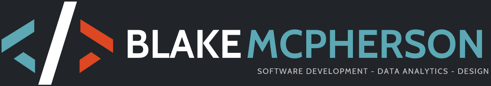

Welcome to My Portfolio App! This application is designed to showcase my various projects, including development work, Blender projects, programming challenges, and more. Friends and family can explore my work, leave comments, and keep up with my latest projects.

## Features

- **Project Showcase:** Display your development projects, Blender creations, and programming challenges.
- **Like and Comment:** Friends and family can interact with your projects by liking and leaving comments.
- **Image and GIF Support:** Share images and GIFs to visually showcase your work.

## Technologies Used

- ReactJS
- AWS (for hosting)

## Getting Started

1. Clone the repository:

   ```bash
   git clone https://github.com/Blake14/McPortfolio
   ```

2. Navigate to the project directory:

```bash
cd ./client
```

3. Install dependencies:

```bash
npm install
```

4. Start the development server:

```bash
npm start
```

5. Open your browser and visit http://localhost:3000 to view your portfolio app.

### Contributing

Feel free to contribute to the project by opening issues, submitting pull requests, or providing feedback.
License

This project is licensed under the MIT License.
Contact

If you have any questions or suggestions, feel free to reach out to me at blakemcpherson2@gmail.com.
